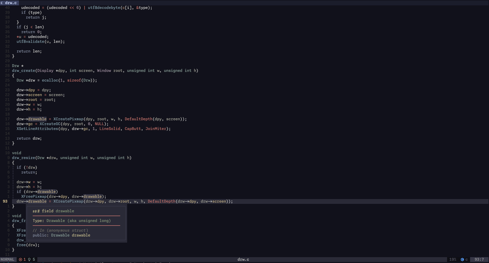
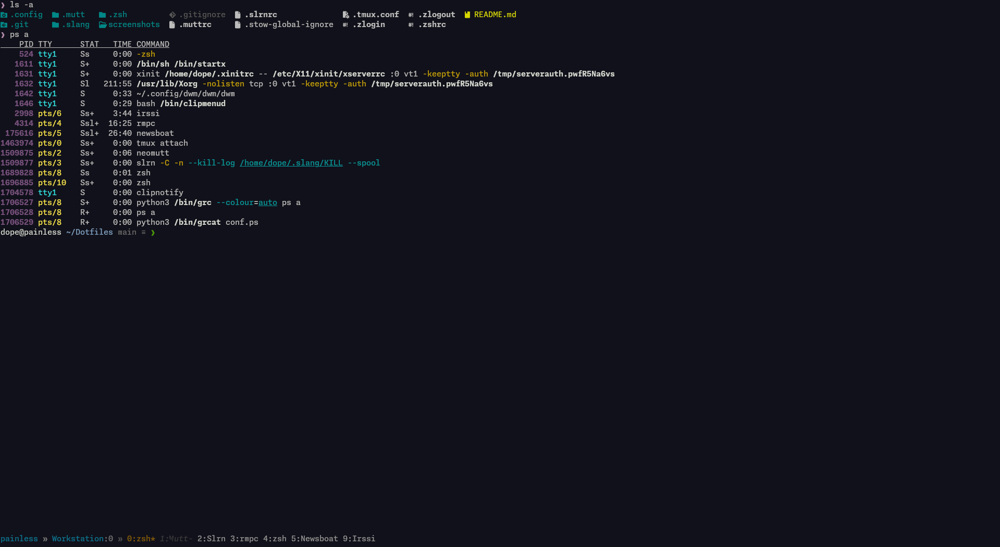

# Well..
These files are only for myself. I suggest those who want to use it to take
it as a reference instead of using it directly.

I am putting these online as much as a reference/archive for myself as for
anyone else out there that might find value in them. Download instead view+save!
So if you are viewing a file with a web browser then do *not* "save" a file
because the contents have already been interpreted - including the control
characters. Instead, you must *download* some files to preserve them. Hints?
Questions? Suggestions? Send a email at dotfiles@strcat.de

## Screenshots

